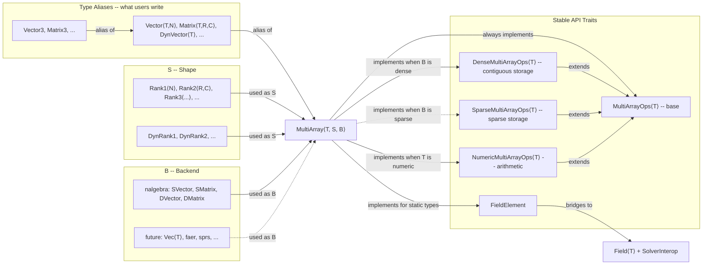
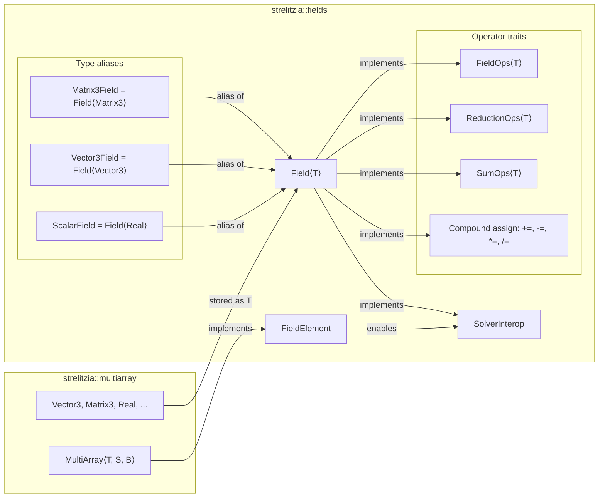

# Architecture

This document describes the design of strelitzia's core data model: how
mathematical types are defined (`multiarray`), how they are collected into
simulation fields (`fields`), and the principles governing their interaction.

Module dependency direction:

```
common  ──▶  multiarray  ──▶  fields
```

`common` has no dependencies. `multiarray` depends on `common`. `fields`
depends on both. No reverse dependencies exist.

---

## 1. MultiArray Type System

All mathematical types in strelitzia -- vectors, matrices, dynamic arrays --
are aliases of a single generic struct.

### 1.1 Design Diagram



#### Reading the diagram

- **Solid arrows** = currently implemented relationships.
- **Dashed arrows** = future/planned relationships (sparse backends, higher-rank tensors).
- `"alias of"` = the left-hand type is a type alias resolving to the right-hand type.
- `"used as S"` / `"used as B"` = the type is plugged into the `S` (shape) or `B` (backend) parameter of `MultiArray`.
- `"always implements"` = unconditional trait implementation.
- `"implements when ..."` = conditional implementation, gated on trait bounds.
- `"extends"` = the child trait is a supertrait of the parent.
- `"bridges to"` = the trait enables interoperation with the target type.

### 1.2 Core Struct

```rust
#[repr(transparent)]
pub struct MultiArray<T, S, B> {
    data: B,
    _phantoms: PhantomData<(T, S)>,
}
```

| Parameter | Role | Examples |
|-----------|------|----------|
| `T` | Element type | `f64`, `f32`, `i32` |
| `S` | Shape -- encodes tensor rank and dimensions | `Rank1<3>`, `Rank2<3,3>`, `DynRank1` |
| `B` | Backend -- actual storage implementation | `na::SVector<T,N>`, `na::DMatrix<T>` |

`#[repr(transparent)]` guarantees zero-cost wrapping and safe pointer casting (critical for `SolverInterop`).

### 1.3 Type Alias Hierarchy

Users never write `MultiArray<T, S, B>` directly. They use type aliases:

```
Vector<T, N>     = MultiArray<T, Rank1<N>,   na::SVector<T, N>>
Matrix<T, R, C>  = MultiArray<T, Rank2<R,C>, na::SMatrix<T, R, C>>
DynVector<T>     = MultiArray<T, DynRank1,   na::DVector<T>>
DynMatrix<T>     = MultiArray<T, DynRank2,   na::DMatrix<T>>

Vector3 = Vector<Real, 3>       Point3 = Vector3
Matrix3 = Matrix<Real, 3, 3>    Point2 = Vector2
...                              ...
```

Adding new aliases (e.g. `Tensor3`, `DynTensor3`) is a non-breaking change.

### 1.4 Trait Hierarchy

#### Stable API traits (permanent contract)

These trait signatures are frozen. User code depending on them will never break.

| Trait | Extends | Purpose | Key methods |
|-------|---------|---------|-------------|
| `MultiArrayOps<T>` | -- | Base interface for ANY multi-dimensional array | `len()`, `is_empty()`, `rank()` |
| `DenseMultiArrayOps<T>` | `MultiArrayOps<T>` | Contiguous memory access | `as_slice()`, `as_mut_slice()` |
| `SparseMultiArrayOps<T>` | `MultiArrayOps<T>` | Sparse storage (future) | `nnz()` |
| `NumericMultiArrayOps<T>` | `MultiArrayOps<T>` + `std::ops` traits | Arithmetic operator bundle | No methods -- pure supertrait bundle |

#### Conditional implementation

`MultiArray<T, S, B>` implements each trait based on bounds:

| Trait | Condition |
|-------|-----------|
| `MultiArrayOps<T>` | Always (any `T`, `S`, `B`) |
| `DenseMultiArrayOps<T>` | When `B: DenseRawStorage<T>` |
| `NumericMultiArrayOps<T>` | When `T` is numeric and all `std::ops` traits are satisfied |
| `FieldElement` | For static types (`Vector<T,N>`, `Matrix<T,R,C>`) |

#### Extension traits (domain operations)

Defined in `multiarray/linalg.rs`. Users must `use` the trait to access methods.

| Trait | Implemented for | Key methods |
|-------|----------------|-------------|
| `VectorOps<T>` | `Vector<T, N>` | `dot`, `norm`, `l1_norm`, `l2_norm`, `linf_norm`, `lp_norm`, `norm_squared`, `normalised` |
| `CrossProduct<T>` | `Vector<T, 2>`, `Vector<T, 3>` | `cross` (2D returns `Vector<T,3>`) |
| `OuterProduct<T, Rhs>` | `Vector<T, N>` | `outer` (returns `Matrix<T,N,M>`) |
| `Hadamard` | All `MultiArray` (blanket) | `hadamard` (element-wise multiply) |
| `Transpose` | `Vector<T,N>`, `Matrix<T,R,C>` | `transpose` |
| `SquareMatrixOps<T>` | Placeholder | `inverse`, `determinant`, `trace` |

### 1.5 Internal Traits (hidden from users)

#### Shape

```rust
pub trait Shape: Copy + 'static {
    const RANK: usize;           // 1 for vectors, 2 for matrices
    const SIZE: Option<usize>;   // None for dynamic types
}
```

Implemented by: `Rank1<N>`, `Rank2<R,C>`, `DynRank1`, `DynRank2`.

#### RawStorage / DenseRawStorage

```rust
pub trait RawStorage<T> {
    fn len(&self) -> usize;
}
pub trait DenseRawStorage<T>: RawStorage<T> {
    fn as_slice(&self) -> &[T];
    fn as_mut_slice(&mut self) -> &mut [T];
}
```

Mirror the public trait hierarchy: `RawStorage` maps to `MultiArrayOps`, `DenseRawStorage` maps to `DenseMultiArrayOps`.

---

## 2. Field Collections

`Field<T>` is the simulation-data collection layer. It stores homogeneous
arrays of multiarray elements and provides zero-copy solver interop.

### 2.1 Design Diagram



#### Reading the diagram

- **Solid arrows** = currently implemented relationships.
- `"stored as T"` = the multiarray type is used as the element type of `Field<T>`.
- `"implements"` = the source type implements the target trait.
- `"enables"` = the trait enables access to the target functionality.
- `"alias of"` = a type alias resolving to `Field<T>` with a concrete `T`.

### 2.2 Core Struct

```rust
#[derive(Debug, Clone)]
pub struct Field<T> {
    data: Vec<T>,
}
```

`Field<T>` is deliberately minimal: a `Vec<T>` wrapper that provides a
consistent API, type safety, and a stable extension point. The inner `Vec` is
private -- all access goes through the public API, allowing future changes
(e.g. GPU-backed storage, arena allocation, parallel iterators) without
breaking user code.

| Alias | Definition | Element components |
|-------|-----------|-------------------|
| `ScalarField` | `Field<Real>` | 1 |
| `Vector3Field` | `Field<Vector3>` | 3 |
| `Matrix3Field` | `Field<Matrix3>` | 9 |

Adding new aliases (e.g. `Vector2Field`, `Matrix4Field`) is a one-line,
non-breaking change.

### 2.3 FieldElement -- bridge between multiarray and fields

```rust
pub trait FieldElement: Copy {
    type Scalar: Copy;
    const COMPONENTS: usize;
    fn component(&self, i: usize) -> Self::Scalar;
    fn from_scalars(data: &[Self::Scalar]) -> Self;
}
```

| Implementor | Scalar | COMPONENTS |
|------------|--------|-----------|
| `Real` | `Real` | 1 |
| `Vector<T, N>` (static) | `T` | `N` |
| `Matrix<T, R, C>` (static) | `T` | `R * C` |

`FieldElement` is the sole requirement for generic `SolverInterop`. Any new
multiarray type that implements `FieldElement` automatically gets zero-copy
solver access when stored in a `Field`.

### 2.4 SolverInterop -- zero-copy flat slice access

```rust
pub trait SolverInterop {
    fn as_flat_slice(&self) -> &[Real];
    fn as_flat_slice_mut(&mut self) -> &mut [Real];
}
```

One generic implementation covers all field types:

```rust
impl<M: FieldElement<Scalar = Real>> SolverInterop for Field<M> { ... }
```

**Safety invariant**: `MultiArray` is `#[repr(transparent)]` over nalgebra's
contiguous storage. `FieldElement::COMPONENTS` guarantees the correct element
count. Together these ensure the pointer cast in `as_flat_slice` is sound.

### 2.5 Operation Traits

| Trait | Bound on T | Key methods |
|-------|-----------|-------------|
| `FieldOps<T>` | `T: Clone` | `fill`, `resize`, `clear` |
| `ReductionOps<T>` | `T: PartialOrd + Copy` | `max`, `min` |
| `SumOps<T>` | `T: Sum + Copy` | `sum` |

### 2.6 Legacy Cast Utilities

`cast.rs` provides free functions (`as_flat_slice`, `as_flat_slice_mut`,
`as_flat_slice_matrix3`, `as_flat_slice_mut_matrix3`) that operate directly on
slices of multiarray types. These predate the generic `SolverInterop`
implementation and are retained for backward compatibility and for use outside
of `Field<T>` (e.g. interop with raw slices from external code).

New code should prefer `SolverInterop` on `Field<T>`.

---

## 3. Operator Design

Operators follow a two-tier philosophy: **full arithmetic** on small
stack-allocated multiarray elements, **compound-assignment only** on large
heap-allocated field collections.

### 3.1 MultiArray Operators

Full set of operators via **blanket impls** on `MultiArray`:

| Operator | Trait | Bound on B |
|----------|-------|-----------|
| `a + b` | `Add` | `B: Add<Output=B>` |
| `a - b` | `Sub` | `B: Sub<Output=B>` |
| `-a` | `Neg` | `B: Neg<Output=B>` |
| `scalar * a` | `Mul<MultiArray>` | `B: Mul<Real, Output=B>` |
| `a / scalar` | `Div<T>` | `B: Div<T, Output=B>` |
| `a += b` | `AddAssign` | `B: AddAssign` |
| `a -= b` | `SubAssign` | `B: SubAssign` |
| `a *= scalar` | `MulAssign<T>` | `B: MulAssign<T>` |
| `a /= scalar` | `DivAssign<T>` | `B: DivAssign<T>` |

One impl per operator covers ALL type aliases. Any future backend that
implements the corresponding `std::ops` trait automatically gets the operator
on `MultiArray`.

### 3.2 Matrix Multiplication

Dedicated cross-type `Mul` impls:

| Expression | Types | Result |
|-----------|-------|--------|
| `mat * mat` | `Matrix<T,R,K> * Matrix<T,K,C>` | `Matrix<T,R,C>` |
| `mat * v` | `Matrix<T,R,C> * Vector<T,C>` | `Vector<T,R>` |
| `v * w.transpose()` | `Vector<T,N> * Matrix<T,1,M>` | `Matrix<T,N,M>` (outer product) |
| `v.transpose() * w` | `Matrix<T,1,N> * Vector<T,N>` | `Vector<T,1>` (dot, via `.to_scalar()`) |

### 3.3 Field Operators

**Only compound assignment** -- no binary operators that allocate:

| Operator | RHS type | Bound on T | Semantics |
|----------|---------|-----------|-----------|
| `field += &other` | `&Field<T>` | `T: Add<T, Output=T> + Copy` | Element-wise |
| `field -= &other` | `&Field<T>` | `T: Sub<T, Output=T> + Copy` | Element-wise |
| `field *= scalar` | `Real` | `T: Mul<Real, Output=T> + Copy` | Broadcast |
| `field /= scalar` | `Real` | `T: Div<Real, Output=T> + Copy` | Broadcast |
| `field += scalar` | `Real` | `T: Add<Real, Output=T> + Copy` | Broadcast |
| `field -= scalar` | `Real` | `T: Sub<Real, Output=T> + Copy` | Broadcast |

Field-to-field operators panic on length mismatch (fail-fast in debug builds).

### 3.4 Why the two-tier split?

`MultiArray` elements (e.g. `Vector3`) are small, fixed-size, stack-allocated
values -- copying 3 floats is trivial, so `a + b` is fine.

`Field` wraps a heap-allocated `Vec` of potentially millions of elements. A
binary `field1 + field2` would silently allocate a million-element result.
Compound assignment (`field1 += &field2`) mutates in place with zero
allocation, making the cost explicit.

---

## 4. File Structure

```
src/common.rs               Crate-wide types: Real (precision alias)

src/multiarray/             The mathematical container type system
  mod.rs                    Module exports
  types.rs                  MultiArray struct, Shape trait + types, RawStorage/DenseRawStorage
  traits.rs                 MultiArrayOps, DenseMultiArrayOps, NumericMultiArrayOps + impls,
                            Index/IndexMut
  operators.rs              Blanket std::ops impls, matrix multiplication, Sum
  aliases.rs                Type aliases (Vector, Matrix, DynVector, etc.) + constructors
  linalg.rs                 Extension traits: VectorOps, CrossProduct, OuterProduct,
                            Hadamard, Transpose, SquareMatrixOps

src/fields/                 Simulation field collections
  mod.rs                    Module exports
  storage.rs                Field<T>, FieldElement trait, SolverInterop (generic impl),
                            type aliases
  ops.rs                    Field compound assignment operators, FieldOps, ReductionOps, SumOps
  cast.rs                   Legacy zero-copy slice utilities (retained for compatibility)
```

---

## 5. API Stability

### Permanent (never changes)

- Trait names and method signatures: `MultiArrayOps`, `DenseMultiArrayOps`,
  `NumericMultiArrayOps`, `FieldElement`, `SolverInterop`
- Type alias names: `Vector3`, `Matrix3`, `Vector<T,N>`, `Matrix<T,R,C>`,
  `DynVector<T>`, `DynMatrix<T>`, `ScalarField`, `Vector3Field`, `Matrix3Field`
- Extension trait signatures: `VectorOps`, `CrossProduct`, `OuterProduct`,
  `Hadamard`, `Transpose`
- `Field<T>` struct name and public method signatures
- Operator semantics (binary for multiarray, compound-assignment for fields)

### Implementation details (can evolve)

- `MultiArray<T, S, B>` struct internals (hidden behind aliases)
- Shape types (`Rank1`, `Rank2`, etc.) -- hidden behind aliases
- The nalgebra backend -- swappable for faer, ndarray, etc.
- `RawStorage<T>` trait -- internal plumbing
- `Field<T>` inner storage representation (currently `Vec<T>`)
- `cast.rs` free functions (legacy, may be deprecated)
- Panic vs. `Result` for field length mismatches (may evolve to `Result`)

### Non-breaking extensions

- New type aliases (e.g. `Tensor3`, `DynTensor3`, `Vector2Field`)
- New operator trait impls on `MultiArray`
- New extension traits or methods in `linalg.rs`
- New `FieldElement` implementations
- New field operation traits (e.g. `NormOps`, `InterpolationOps`)
- Additional metadata on `Field<T>` (e.g. mesh association)
- GPU-backed or arena-backed storage variants

---

## 6. Extending the System

### Adding a new multiarray type alias (e.g. Tensor3)

1. Define a new shape type:
   ```rust
   pub struct Rank3<const D1: usize, const D2: usize, const D3: usize>;
   impl<...> Shape for Rank3<D1, D2, D3> { const RANK: usize = 3; ... }
   ```
2. Choose or implement a backend (e.g. `Vec<T>` for heap storage).
3. Implement `RawStorage<T>` and `DenseRawStorage<T>` for the backend.
4. Define the alias:
   ```rust
   pub type Tensor3<T, const D1: usize, const D2: usize, const D3: usize>
       = MultiArray<T, Rank3<D1, D2, D3>, Vec<T>>;
   ```
5. All blanket operator impls and trait impls apply automatically.

### Adding a new backend (e.g. faer)

1. Implement `RawStorage<T>` and `DenseRawStorage<T>` for the new backend type.
2. Implement `std::ops` traits (`Add`, `Sub`, etc.) on the backend type.
3. Define type aliases using the new backend:
   ```rust
   pub type FaerMatrix<T, const R: usize, const C: usize>
       = MultiArray<T, Rank2<R, C>, faer::Mat<T>>;
   ```
4. All existing traits and operators apply automatically via blanket impls.

### Adding a new extension trait

1. Define the trait in `multiarray/linalg.rs`:
   ```rust
   pub trait NewOp<T> {
       fn my_method(&self) -> T;
   }
   ```
2. Implement for specific type aliases:
   ```rust
   impl<T: na::RealField + Copy, const N: usize> NewOp<T> for Vector<T, N> { ... }
   ```
3. Export from `mod.rs`. Users `use` the trait to access the methods.

### Adding a new field type alias

1. Ensure the element type implements `FieldElement` (automatic for static
   `Vector<T,N>` and `Matrix<T,R,C>`).
2. Add the alias in `fields/storage.rs`:
   ```rust
   pub type Vector4Field = Field<Vector4>;
   ```
3. All operators, `FieldOps`, `ReductionOps`, `SumOps`, and `SolverInterop`
   apply automatically.

### Adding a new field operation trait

1. Define the trait in `fields/ops.rs`:
   ```rust
   pub trait NormOps {
       fn l2_norms(&self) -> ScalarField;
   }
   ```
2. Implement for the relevant `Field<T>`:
   ```rust
   impl NormOps for Vector3Field {
       fn l2_norms(&self) -> ScalarField { ... }
   }
   ```
3. Re-export from `mod.rs` (automatic via `pub use ops::*`).

### Migrating Field to a different backing store

1. Replace `Vec<T>` with the new storage inside `Field<T>`.
2. Update the `Field<T>` methods to delegate to the new storage.
3. All user code continues to work -- the `Vec<T>` is private.

---

## 7. Design Rationale

### Why one struct, not separate Vector/Matrix types?

Following nalgebra's philosophy: a vector IS a single-column matrix. One
`MultiArray<T, S, B>` struct avoids code duplication. Dimension-specific
behaviour comes from `S` (shape) and concrete `impl` blocks on specific
aliases. This also means matrix multiplication `Matrix * Vector` works
naturally via cross-type `Mul` impls.

### Why extension traits for domain operations?

Separation of concerns. `MultiArray` is a data container -- it should not know
about dot products, cross products, or norms. Extension traits (`VectorOps`,
`CrossProduct`, etc.) add domain operations with method syntax but without
polluting the core type. Each trait is implemented only for the types it
applies to (e.g. `CrossProduct` for 2D/3D vectors only).

### Why blanket operator impls?

One `impl<T, S, B: Add<Output=B>> Add for MultiArray<T, S, B>` covers all
current and future type aliases. Without blanket impls, every new type alias or
backend would need N separate operator implementations.

### Why `Field<T>` instead of `Vec<T>`?

Semantic clarity (`Vector3Field` communicates intent), controlled API surface
(only domain-appropriate methods exposed), and a stable extension point
(metadata, GPU storage, arena allocation can be added without breaking
changes). The operator discipline -- compound-assignment only -- is enforced
by the wrapper.

### Why `FieldElement` instead of per-type SolverInterop?

A single generic `impl<M: FieldElement<Scalar=Real>> SolverInterop for
Field<M>` replaces N manual implementations with copy-pasted unsafe code.
Adding new field element types (e.g. `Vector4`, `Matrix2`) requires zero new
unsafe code.

### Why unsafe in SolverInterop?

Solver libraries (PETSc, Hypre, Trilinos) expect flat `&[f64]` arrays.
Copying millions of elements from structured storage to a flat buffer on every
solver call is prohibitively expensive. The `#[repr(transparent)]` guarantee on
`MultiArray` plus nalgebra's contiguous memory layout make the pointer cast
sound. The unsafe block is centralised in one place and guarded by the
`FieldElement::COMPONENTS` contract.
