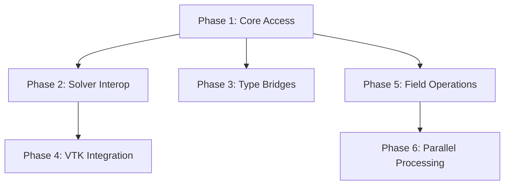

# Fields Module Expansion Plan

A phased approach to evolving the `src/fields/` module from a basic AoSoA container into a production-ready scientific computing foundation.

---

## Phase 1: Core Access Patterns

**Goal**: Make `Field` usable for basic read/write operations.

**Duration**: 1-2 hours

### Tasks

1. **Add indexed access (`get`, `set`)** in [`src/fields/layout.rs`](src/fields/layout.rs)
   - `get(idx: usize) -> [E; N]` — random read access
   - `set(idx: usize, components: [E; N])` — random write access
   - Add bounds checking with clear panic messages

2. **Implement `Iterator`** for `Field`
   - Create new file `src/fields/iterators.rs`
   - `FieldIter<'a, S, E, N>` — immutable iteration
   - `FieldIterMut<'a, S, E, N>` — mutable iteration
   - Implement `IntoIterator` for ergonomic `for` loops

3. **Add `Default` impl** to satisfy Clippy and convention
   - `Field::default()` equivalent to `Field::new()`

4. **Update module exports** in [`src/fields/mod.rs`](src/fields/mod.rs)

### Deliverable
```rust
let mut field: Vector3Field = Field::new();
field.push_raw([1.0, 2.0, 3.0]);
field.set(0, [4.0, 5.0, 6.0]);
for v in &field {
    println!("{:?}", v);
}
```

---

## Phase 2: Solver Interoperability

**Goal**: Enable use with linear algebra solvers (faer, nalgebra, ndarray).

**Duration**: 1-2 hours

**Depends on**: Phase 1

### Tasks

1. **Add gather/scatter methods** in [`src/fields/layout.rs`](src/fields/layout.rs)
   - `gather_to_flat(&self, out: &mut [E])` — AoSoA to flat AoS
   - `scatter_from_flat(&mut self, inp: &[E])` — flat AoS to AoSoA
   - Layout: `[x0, y0, z0, x1, y1, z1, ...]`

2. **Add allocation helpers**
   - `with_capacity(n: usize)` — pre-allocate chunks
   - `reserve(additional: usize)` — grow capacity

3. **Add bulk initialization**
   - `from_flat(data: &[E]) -> Self` — construct from flat array
   - `zeros(n: usize) -> Self` — create zero-initialized field

### Deliverable
```rust
let mut solver_vec = vec![0.0; velocities.len() * 3];
velocities.gather_to_flat(&mut solver_vec);
// ... solver.solve(&mut solver_vec) ...
velocities.scatter_from_flat(&solver_vec);
```

---

## Phase 3: Cross-Crate Type Bridges

**Goal**: Seamless interop with `mint`, `nalgebra`, `glam`.

**Duration**: 2-3 hours

**Depends on**: Phase 1

### Tasks

1. **Create `src/fields/interop.rs`** — dedicated bridge module

2. **Implement `mint` bridge** (universal interchange)
   - `push_mint(v: impl Into<mint::Vector3<E>>)`
   - `get_mint(idx) -> mint::Vector3<E>`
   - Feature-gated: `#[cfg(feature = "mint")]`

3. **Implement `nalgebra` bridge**
   - `push_nalgebra(v: nalgebra::SVector<E, N>)`
   - `get_nalgebra(idx) -> nalgebra::SVector<E, N>`
   - Feature-gated: `#[cfg(feature = "nalgebra-interop")]`

4. **Implement `glam` bridge**
   - `push_glam(v: glam::Vec3)` (for f32 fields)
   - `push_glam(v: glam::DVec3)` (for f64 fields)
   - Feature-gated: `#[cfg(feature = "glam-interop")]`

5. **Update [`Cargo.toml`](Cargo.toml)** with feature flags
   ```toml
   [features]
   mint = []
   nalgebra-interop = []
   glam-interop = []
   ```

### Deliverable
```rust
use nalgebra::Vector3;
velocities.push_nalgebra(Vector3::new(1.0, 2.0, 3.0));
let v: Vector3<f64> = velocities.get_nalgebra(0);
```

---

## Phase 4: Visualization Integration

**Goal**: Direct export to VTK/ParaView via existing visualiser module.

**Duration**: 1-2 hours

**Depends on**: Phase 2

### Tasks

1. **Add VTK export trait** in `src/fields/interop.rs` or new `src/fields/vtk.rs`
   - Implement bridge to [`FieldArray`](src/visualiser/vtk_types.rs)
   - Handle component count mapping (1=scalar, 3=vector, 9=tensor)

2. **Create convenience method**
   ```rust
   impl Field<S, f64, N> {
       pub fn to_vtk_array<'a>(&'a self, name: &'a str, buf: &'a mut Vec<f64>) -> FieldArray<'a>
   }
   ```

3. **Add integration test** demonstrating full pipeline:
   - Create mesh + field data
   - Export to `.vtu`
   - Validate file structure

### Deliverable
```rust
let mut buf = Vec::new();
let velocity_array = velocities.to_vtk_array("velocity", &mut buf);
write_vtu("output.vtu", &points, &cells, &[velocity_array], Encoding::Base64)?;
```

---

## Phase 5: Field Operations

**Goal**: Common mathematical operations on fields.

**Duration**: 2-3 hours

**Depends on**: Phase 1

### Tasks

1. **Create `src/fields/ops.rs`** — operations module

2. **Implement in-place operations**
   - `scale(&mut self, factor: E)` — multiply all components
   - `add(&mut self, other: &Self)` — element-wise addition
   - `sub(&mut self, other: &Self)` — element-wise subtraction

3. **Implement reduction operations**
   - `sum(&self) -> [E; N]` — sum all elements
   - `max_magnitude(&self) -> E` — for convergence checks

4. **Add operator overloads** (optional)
   - `impl AddAssign for Field`
   - `impl MulAssign<E> for Field`

### Deliverable
```rust
velocities.scale(0.99);  // Apply drag
velocities.add(&forces); // Euler integration step
let max_v = velocities.max_magnitude();
```

---

## Phase 6: Parallel Processing

**Goal**: Multi-threaded operations via Rayon.

**Duration**: 2-3 hours

**Depends on**: Phase 5

### Tasks

1. **Add Rayon feature flag** in [`Cargo.toml`](Cargo.toml)
   ```toml
   [features]
   parallel = ["rayon"]
   
   [dependencies]
   rayon = { version = "1.10", optional = true }
   ```

2. **Add parallel iterators** in `src/fields/iterators.rs`
   - `par_iter()` — parallel immutable iteration
   - `par_iter_mut()` — parallel mutable iteration
   - Feature-gated: `#[cfg(feature = "parallel")]`

3. **Add parallel operations** in `src/fields/ops.rs`
   - `par_scale(&mut self, factor: E)`
   - `par_apply<F>(&mut self, f: F)` — generic parallel transform

4. **Add benchmarks** comparing serial vs parallel

### Deliverable
```rust
#[cfg(feature = "parallel")]
velocities.par_apply(|chunk| {
    for v in chunk.iter_mut() {
        *v *= 0.99;
    }
});
```

---

## Dependency Graph



---

## File Structure After Completion

```
src/fields/
├── mod.rs           # Public exports
├── layout.rs        # Field<S, E, N>, Chunk<E, N>, get/set, gather/scatter
├── types.rs         # Scalar, Vector, Tensor, SymmTensor
├── traits.rs        # FieldView trait
├── aliases.rs       # Real, Vector3Field, etc.
├── iterators.rs     # [NEW] FieldIter, FieldIterMut, par_iter
├── interop.rs       # [NEW] mint, nalgebra, glam bridges
├── ops.rs           # [NEW] scale, add, sum, max_magnitude
└── vtk.rs           # [NEW] to_vtk_array bridge
```

---

## Recommended Execution Order

| Week | Phase | Effort |
|------|-------|--------|
| 1 | Phase 1: Core Access | 1-2 hrs |
| 1 | Phase 2: Solver Interop | 1-2 hrs |
| 2 | Phase 5: Field Operations | 2-3 hrs |
| 2 | Phase 3: Type Bridges | 2-3 hrs |
| 3 | Phase 4: VTK Integration | 1-2 hrs |
| 3 | Phase 6: Parallel Processing | 2-3 hrs |

This order prioritizes internal functionality (Phases 1, 2, 5) before external integrations (Phases 3, 4, 6).

